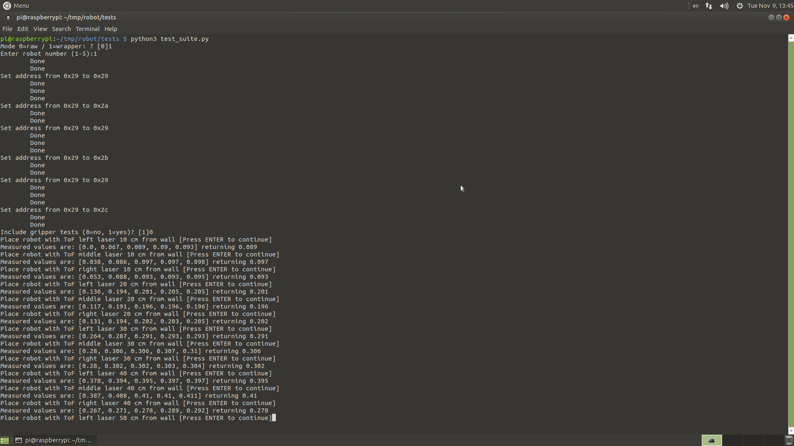

# Running the test sequence

To run the tests execute `python3 test_suite.py` on the robot.

## Raw mode vs Wrapped mode

Raw mode uses `commRaspMain.py` (low-level API) and wrapped mode uses the `PiBot.py` high-level API.

In raw mode, the values are read and reported directly from low-level API.

In wrapped mode, the `convertersN.txt` (`N =  {1, 2, 3, 4, 5}`) calibration file is used.

Generally, **wrapped mode testing is preferred** since this is what the user will experience and gives a better end-to-end test result.

## Output

The output is stored into a csv file with a timestamp (e.g., `results_20211108161655.csv`).
